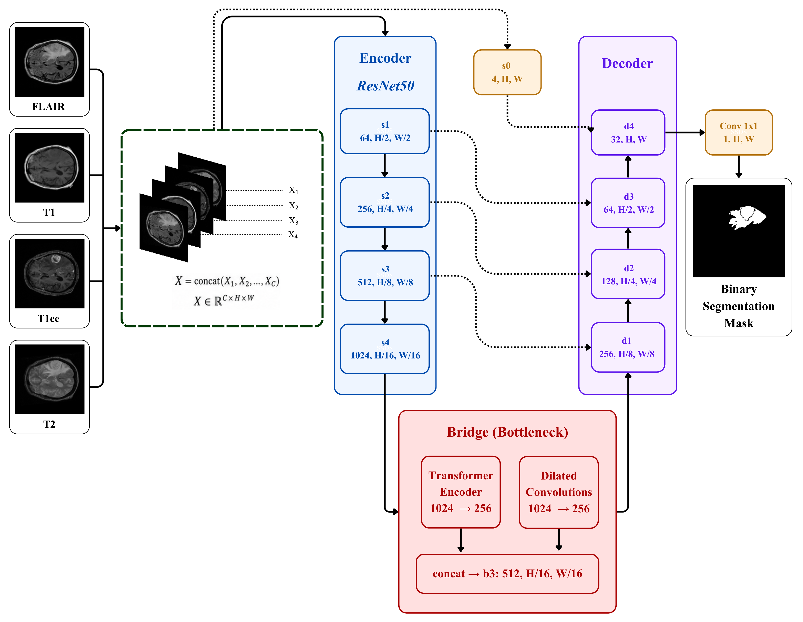
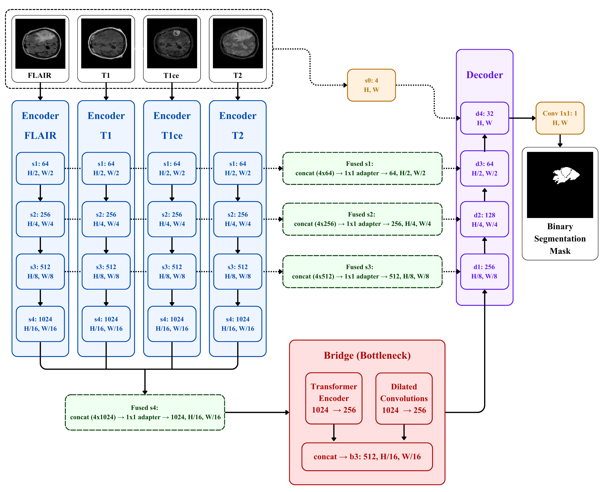
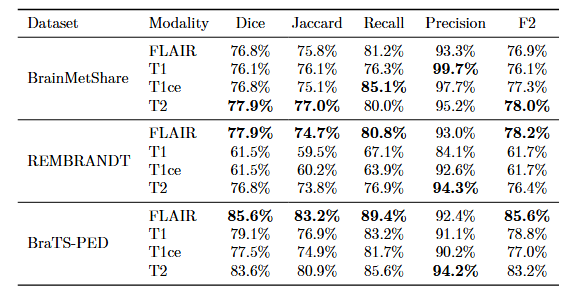
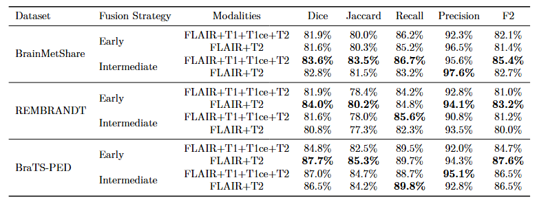

# TransResU-Net for Multimodal Brain Tumor Segmentation

This repository implements two multimodal MRI fusion strategies for binary whole-tumor segmentation derived from the TransResU-Net architecture [1]. Different MRI modalities provide complementary information about brain tissue and tumor appearance, as FLAIR, T1, T1ce, and T2 highlight distinct anatomical and pathological characteristics.

The project investigates how these modalities can be integrated within a TransResU-Net-based segmentation model through two proposed approaches:

1. **Early fusion**: the selected MRI modalities are concatenated at the input level and processed by a shared encoder.
2. **Intermediate fusion**: each MRI modality is processed by a dedicated encoder, while the resulting feature maps are fused at multiple resolution levels before being passed to the bridge and decoder.

The experimental evaluation includes eight configurations:

* four single-modality baselines, using FLAIR, T1, T1ce, and T2 individually;
* early fusion using all four MRI modalities;
* early fusion using FLAIR and T2 (selected based on their strong individual performance);
* intermediate fusion using all four MRI modalities;
* intermediate fusion using FLAIR and T2 (selected based on their strong individual performance).

The models are evaluated on three public brain MRI datasets representing distinct clinical contexts:

* **BrainMetShare** contains MRI scans of patients with brain metastases [2].
* **REMBRANDT** includes MRI scans of adult patients with primary brain tumors [3].
* **BraTS-PED** contains MRI scans of pediatric patients with primary brain tumors [4].

---

## Base Architecture

Both strategies are derived from **TransResU-Net** [1], an encoder-decoder segmentation architecture that combines:

- a ResNet50 encoder [5];
- U-Net skip connections [6];
- a Transformer branch in the bridge;
- a dilated convolution branch in the bridge;
- a residual decoder;
- a final $1 \times 1$ convolution for binary segmentation.

---

## Proposed Architectures

### 1. Early Fusion

In the early-fusion strategy, the selected MRI modalities are concatenated along the channel dimension before feature extraction. A single shared ResNet50 encoder [5] processes the resulting tensor.

<p align="center">
  
</p>

<p align="center">
  <em>Proposed early-fusion adaptation of TransResU-Net [1]: MRI modalities are concatenated at the input level and processed by a shared encoder.</em>
</p>

### 2. Intermediate Fusion

In the intermediate-fusion strategy, each MRI modality is processed by an independent ResNet50 encoder [5]. At each corresponding resolution level, the extracted feature maps are concatenated along the channel dimension and passed through a fusion layer consisting of:

- a $1 \times 1$ convolution;
- batch normalization;
- ReLU activation.

The modality-specific encoders are pretrained independently and then frozen while the fusion layers, bridge, and decoder are trained.

<p align="center">
  
</p>

<p align="center">
  <em>Proposed intermediate-fusion adaptation of TransResU-Net [1]: modality-specific encoders extract independent representations that are fused at multiple resolution levels.</em>
</p>

---

## Experimental Setup

| Component | Configuration |
|---|---|
| Task | Binary whole-tumor segmentation |
| Input representation | 2D axial MRI slices |
| Image resolution | $256 \times 256$ |
| Modalities | FLAIR, T1, T1ce, T2 |
| Data split | 70% training, 15% validation, 15% test |
| Split level | Patient level |
| Optimizer | Adam [8] |
| Initial learning rate | $10^{-4}$ |
| Learning-rate scheduler | ReduceLROnPlateau |
| Batch size | 16 |
| Training | 20 epochs |
| Loss | Binary Cross-Entropy + Dice loss |
| Numerical precision | Mixed precision |
| Framework | PyTorch [7] |

---

## Results

### Single-Modality Results

<p align="center">
  
</p>

<p align="center">
  <em>Segmentation performance obtained using the early-fusion architecture with each MRI modality evaluated individually.</em>
</p>

FLAIR and T2 provide the strongest single-modality performance across the three datasets.

### Multimodal Fusion Results

<p align="center">
  
</p>

<p align="center">
  <em>Segmentation performance of the early- and intermediate-fusion multimodal configurations.</em>
</p>

Intermediate fusion using all four modalities achieves the highest Dice score on BrainMetShare (**83.6%**), whereas early fusion using FLAIR and T2 performs best on REMBRANDT (**84.0%**) and BraTS-PED (**87.7%**). These results show that the optimal fusion strategy depends on the characteristics of the dataset.

---

## Repository Structure

```text
.
├── checkpoints/
│   └── <dataset>/
│       ├── encoders/
│       ├── early_fusion_*.pth
│       └── intermediate_fusion_*.pth
│
├── datasets/
│   ├── bmshare/
│   ├── rembrandt2/
│   └── brats_ped/
│
├── results/
│   └── <dataset>/
│       ├── early_fusion_*.csv
│       └── intermediate_fusion_*.csv
│
├── train_log/
│
├── src/
│   ├── early_fusion/
│   │   ├── __init__.py
│   │   ├── model.py
│   │   ├── resnet.py
│   │   ├── train.py
│   │   └── test.py
│   │
│   ├── intermediate_fusion/
│   │   ├── __init__.py
│   │   ├── model.py
│   │   ├── resnet.py
│   │   ├── train.py
│   │   └── test.py
│   │
│   ├── dataset.py
│   ├── metrics.py
│   ├── splits.py
│   └── utils.py
│
├── .gitignore
├── README.md
└── requirements.txt
```

---

## Dataset Organization

The repository expects the datasets to be preprocessed into aligned 2D axial slices.

A patient directory should follow the structure below:

```text
datasets/<dataset_name>/<case_id>/
├── 0/                      # FLAIR
│   ├── <slice_name>.png
│   └── ...
├── 1/                      # T1
│   ├── <slice_name>.png
│   └── ...
├── 2/                      # T1ce
│   ├── <slice_name>.png
│   └── ...
├── 3/                      # T2
│   ├── <slice_name>.png
│   └── ...
└── seg/                    # Binary segmentation masks
    ├── <slice_name>.png
    └── ...
```

---

## Installation

Clone the repository:

```bash
git clone https://github.com/cristinadianas/TransResUNet-Multimodal-Segmentation.git
cd TransResUNet-Multimodal-Segmentation
```

Create and activate a Python environment, then install the dependencies:

```bash
pip install -r requirements.txt
```

A CUDA-enabled PyTorch installation is recommended for training.

---

## Experiment Execution

Run all commands below from the repository root directory.

#### Windows PowerShell

```powershell
$env:PYTHONPATH = "$PWD/src"
```

#### Linux or macOS

```bash
export PYTHONPATH="$PWD/src"
```

### Training and Evaluation

```bash
# Early fusion
python -m early_fusion.train
python -m early_fusion.test

# Intermediate fusion
python -m intermediate_fusion.train
python -m intermediate_fusion.test
```

Before running an experiment, verify the dataset name, selected modalities, split file, checkpoint path, and training configuration in the corresponding script.

---

## Upstream Implementation and Attribution

This repository builds on the TransResU-Net architecture introduced by Tomar et al. [1] and the authors’ [official PyTorch implementation](https://github.com/nikhilroxtomar/TransResUNet). The original work addresses real-time colonoscopy polyp segmentation; this project adapts the architecture to multimodal brain MRI and introduces early- and intermediate-fusion strategies for binary brain tumor segmentation.

---

## References

[1] Nikhil Kumar Tomar, Annie Shergill, Brandon Rieders, Ulas Bagci, and Debesh Jha, *TransResU-Net: Transformer Based ResU-Net for Real-Time Colonoscopy Polyp Segmentation*, 2022, doi: 10.48550/arXiv.2206.08985, arXiv: 2206.08985 [eess.IV], url: https://arxiv.org/abs/2206.08985.

[2] Endre Grøvik, Darvin Yi, Michael Iv, Elizabeth Tong, Daniel Rubin, and Greg Zaharchuk, *BrainMetShare*, Stanford Center for Artificial Intelligence in Medicine and Imaging (AIMI), 2020, doi: 10.71718/z66c-qr59, url: https://doi.org/10.71718/z66c-qr59.

[3] Lisa Scarpace, Adam E. Flanders, Rajan Jain, Tom Mikkelsen, and David W. Andrews, *Data From REMBRANDT*, The Cancer Imaging Archive, 2015, doi: 10.7937/K9/TCIA.2015.588OZUZB, url: https://doi.org/10.7937/K9/TCIA.2015.588OZUZB.

[4] Anahita Fathi Kazerooni, Nastaran Khalili, Xinyang Liu, Debanjan Haldar, Zhifan Jiang, Syed Muhammed Anwar, Jake Albrecht, Maruf Adewole, Udunna C. Anazodo, Hannah Anderson et al., *The Brain Tumor Segmentation (BraTS) Challenge 2023: Focus on Pediatrics (CBTN-CONNECT-DIPGR-ASNR-MICCAI BraTS-PEDs)*, 2023, doi: 10.48550/arXiv.2305.17033, arXiv: 2305.17033 [eess.IV], url: https://arxiv.org/abs/2305.17033.

[5] Kaiming He, Xiangyu Zhang, Shaoqing Ren, and Jian Sun, “Deep Residual Learning for Image Recognition,” in *Proceedings of the IEEE Conference on Computer Vision and Pattern Recognition (CVPR)*, 2016, pp. 770–778, doi: 10.1109/CVPR.2016.90, arXiv: 1512.03385 [cs.CV], url: https://arxiv.org/abs/1512.03385.

[6] Olaf Ronneberger, Philipp Fischer, and Thomas Brox, “U-Net: Convolutional Networks for Biomedical Image Segmentation,” in *Medical Image Computing and Computer-Assisted Intervention – MICCAI 2015*, vol. 9351, Lecture Notes in Computer Science, Cham: Springer, 2015, pp. 234–241, doi: 10.1007/978-3-319-24574-4_28, arXiv: 1505.04597 [cs.CV], url: https://arxiv.org/abs/1505.04597.

[7] Adam Paszke, Sam Gross, Francisco Massa, Adam Lerer, James Bradbury, Gregory Chanan, Trevor Killeen, Zeming Lin, Natalia Gimelshein, Luca Antiga, Alban Desmaison, Andreas Köpf, Edward Yang, Zachary DeVito, Martin Raison, Alykhan Tejani, Sasank Chilamkurthy, Benoit Steiner, Lu Fang, Junjie Bai, and Soumith Chintala, “PyTorch: An Imperative Style, High-Performance Deep Learning Library,” in *Advances in Neural Information Processing Systems 32 (NeurIPS 2019)*, Curran Associates, Inc., 2019, pp. 8024–8035, doi: 10.48550/arXiv.1912.01703, arXiv: 1912.01703 [cs.LG], url: https://arxiv.org/abs/1912.01703.

[8] Diederik P. Kingma and Jimmy Ba, “Adam: A Method for Stochastic Optimization,” in *International Conference on Learning Representations (ICLR 2015)*, 2015, doi: 10.48550/arXiv.1412.6980, arXiv: 1412.6980 [cs.LG], url: https://arxiv.org/abs/1412.6980.

---

## License

This repository follows the terms specified by the [upstream TransResU-Net repository](https://github.com/nikhilroxtomar/TransResUNet). The source code is available for research and educational use. Commercial use requires prior permission from the original authors. Any reuse, modification, or redistribution of adapted TransResU-Net code must comply with these terms.
